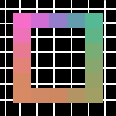

# Pixel Art Uv Mapper

> You can check the roadmap [here](https://woozy-durian-0c5.notion.site/Roadmap-4d4d409b9e0c4a7bb685ba38dfbec057)

- [Pixel Art Uv Mapper](#pixel-art-uv-mapper)
  - [Getting started](#getting-started)
    - [Get used to terminology](#get-used-to-terminology)
  - [Tutorials](#tutorials)
    - [How to create a map texture](#how-to-create-a-map-texture)
    - [How to create a texture to map](#how-to-create-a-texture-to-map)
    - [How to create a skin texture](#how-to-create-a-skin-texture)
    - [How to map a my texture](#how-to-map-a-my-texture)
  - [References](#references)

 

## Getting started

### Get used to terminology

## Tutorials

### How to create a map texture
### How to create a texture to map
### How to create a skin texture

### How to map a my texture
> There is a lot of way to map the texture, PAUM provides a lot of components and shader to achieve this

- ### Using Shader
  PAUM provide a shader to map the texture. You can use it by just creating a new material and assign the shader to it. Then there is three variables in this shader, the first one is the texture to map, the second one is the map texture and the third one is the skin texture. You can assign the textures to these variables in the material inspector.
  Shader is the lightest and quickest way to map your texture. But it presents its limitations : layering is not supported, you can't use custom operators or mutliple layers.
- ### Using Sprite Component
- ### Using Animator Override Component
- ### Using Engine class 
- ### Using Compute Sprite Component

## References
>All the detailled references of each class and components
* ### [Classes](Classes.md)
* ### [Components](Components.md)

