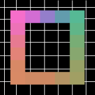
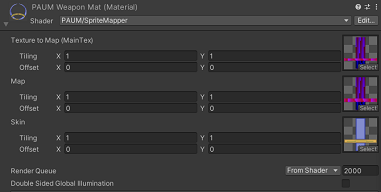
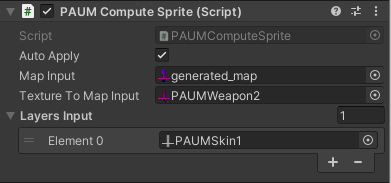

# Pixel Art Uv Mapper 🏠 [Produtcs](../README.md)


>✈️ *You can check the roadmap* [here](https://woozy-durian-0c5.notion.site/Roadmap-4d4d409b9e0c4a7bb685ba38dfbec057)

>✉️ *If you have questions or suggestions, you can contact me on* [Twitter](https://twitter.com/ZEZEL_Dev) *or send me a mail at :* contact@rodriguez-esteban.com

- [Pixel Art Uv Mapper 🏠 Produtcs](#pixel-art-uv-mapper--produtcs)
  - [Getting started](#getting-started)
  - [Get used to terminology](#get-used-to-terminology)
  - [Tutorials](#tutorials)
    - [How to create a map texture](#how-to-create-a-map-texture)
    - [How to create a texture to map](#how-to-create-a-texture-to-map)
    - [How to create a layers/skin texture](#how-to-create-a-layersskin-texture)
    - [How to map a my texture](#how-to-map-a-my-texture)
    - [How to evolve my sprite at runtime](#how-to-evolve-my-sprite-at-runtime)
  - [References](#references)

___

## Getting started

1. First you need to import the package into your unity project.
2. We recommand you to open the demo scene to get familiar with the package.
___
## Get used to terminology

- **Map Texture** : The map texture is the texture that contains unique pixels and it's pixel position will  be used by the layer texture to map the texture to map.
- **Texture to map** : The texture to map is the texture that will be mapped in according to the map texture and the layers texture.
- **Layer/Skin** : The layer texture or the skin texture will be used to map the texture to map in according to the map texture. The layer texture is the texture that contains the pixels that will be mapped in the texture to map. So the layer texture is the texture that contains the rendering of the texture to map.
___
## Tutorials

### How to create a map texture
The map texture is the texture that contains unique pixels color. You will use these pixels to create a texture to map, you can either create a map by your own or use the map generator to create a map texture.

- **Create a map by your own** : You can create a map by your own by creating a texture and then paint the pixels with unique colors.
- **Using the texture generator** : 
  1. Open the map generator window by clicking on the menu `Window/PAUM/Map Builder`.
<!-- TODO: Faire le tuto avec capture -->


### How to create a texture to map
### How to create a layers/skin texture

All the layers texture must have *the same size* as the map texture. The layer texture is the texture that contains the pixels that will be mapped in the texture to map. Pixel positions are important, they define each unique pixel of the map texture. To sum up the layer texture is the texture that contains the rendering pixels of the map.


### How to map a my texture
> There is a lot of way to map the texture, PAUM provides a lot of components and shader to achieve this

  - __Using Shader__
  

  PAUM provide a shader to map the texture. You can use it by just creating a new material and assign the shader to it. Then there is three variables in this shader, the first one is the texture to map, the second one is the map texture and the third one is the skin texture. You can assign the textures to these variables in the material inspector.
  Shader is the lightest and quickest way to map your texture. But it presents its limitations : layering is not supported, you can't use custom operators or mutliple layers.
  -  __Using Sprite Component__
  
  
  Every PAUM component looks like the same, You can assign the map texture, the texture to map input and the layers. There is also an option called ``Auto Apply`` which will automatically apply the changes to the texture to map. If you have the version 2021, component are customized with the new UI toolkit system which provide more informations about the component and also a force apply button. The Sprite Component take more resources than the shader but multi-layering is supported.
  -  __Using Animator Override Component__

  The Animator Override Component is a component that will override the current frame of the animator, you can directly assign the ==sprite sheet== texture into the Texture To Map Input and it will auto map all the frame. Shader is still the fastest and lightest but again Animator Override Component is supporting multi-layering.
  -  __Using Compute Sprite Component__

  The Compute Sprite Component is a component that will use the GPU to map the texture. It's the fastest way to map the texture but it's not supporting multi-layering and it can be less efficient than the shader but it's particulary useful when you have big size texture to map.
  
  -  __Using Engine class__

  You can also use the engine class to map the texture. The engine class is the core of the package, it's the class that will map the texture. You can use it by creating a new instance of the engine class and refer the map texture. Then add some layers, then call the [Apply](Classes.md#-apply) method to build layer. Then you can call the [MapTexture](Classes.md#-maptexture) method with the Texture To Map as an argument it will return the mapped texture.

___
### How to evolve my sprite at runtime

- **With shader** :
  You can modify in run time multiple variables of the shader. You can modify the texture to map, the map texture and the layer texture.
  To access to the shader variables you need to access to the material of the ``Sprite Renderer`` component. Then you can use methods of the ``Material`` class to change property like so :

  ```csharp	
  mat.SetTexture(string name, Texture value);
  ```

  The ``name`` variable is the name of the property you want to change. The ``value`` variable is the value you want to assign to the property. You can find the name of the properties in the wanted shader doc &rarr; [Shader Doc](Shader.md)


- **With component** :
  
  To modify textures of a component at runtime you need to access to its [PAUM_ComponentValue](Classes.md#-paum_componentvalue) property. Then you have access to the ``currentValue`` property which can be modified. Then the component will automatically apply the changes to the texture to map if you turn the bool ``Auto Apply`` to true else you can call the [Apply](Components.md#apply) method to apply the changes.

  *Example* :

  ```csharp
  // Get the component
  PAUMSprite paumSprite = GetComponent<PAUMSprite>();
  // Get the component value
  PAUM_Texture map = paumSprite.map; //can be textureToMap
  // Modify the texture to map
  map.currentValue = newMap;
  // Apply the changes if Auto Apply turned off
  paumSprite.Apply();
  ```

## References
>All the detailled references of each class and components
* ### [Classes](Classes.md)
* ### [Interfaces](Interfaces.md)
* ### [Components](Components.md)
* ### [Shaders](Shader.md)
